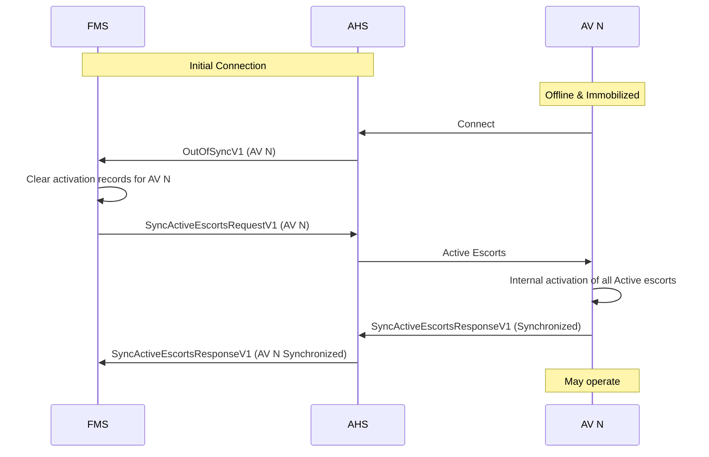
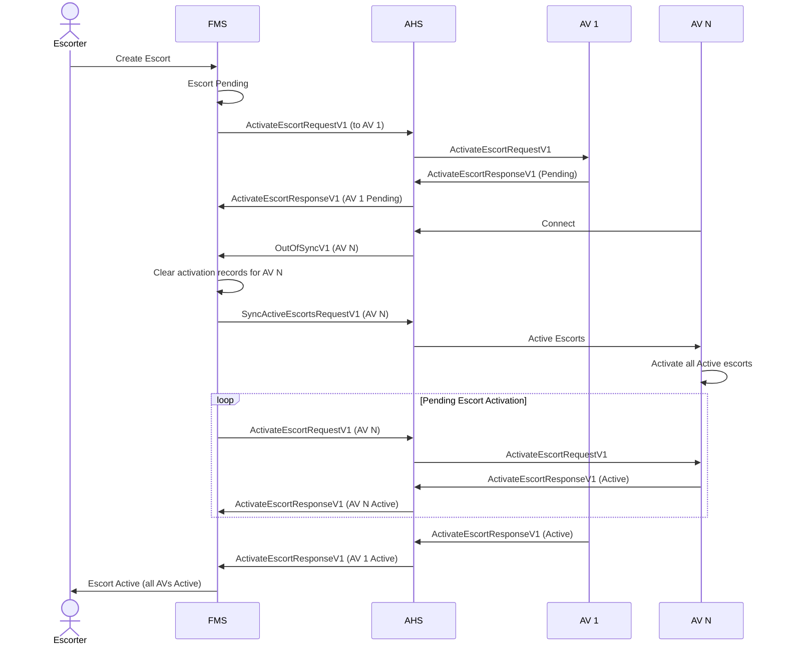
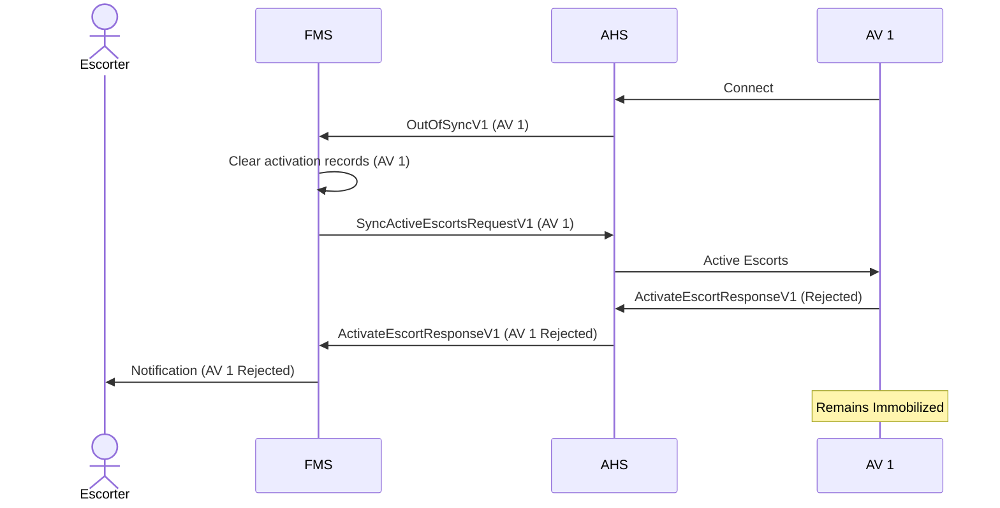

# Synchronization

This document describes the synchronization process ensuring each Autonomous Vehicle (AV) maintains an accurate set of Active escorts. Synchronization occurs on initial connection and after any communication outage.

## Purpose
An AV MUST NOT operate (i.e., leave immobilized state) unless it is synchronized with the Fleet Management System (FMS) regarding all Active escorts. Synchronization guarantees the AV enforces the required Protection and Avoidance Zones.

## Trigger Conditions
Synchronization SHALL be initiated when:
- An AV establishes or re‑establishes connection to the Autonomous Haulage System (AHS).
- The AV detects internal loss of escort state integrity.
- FMS instructs resynchronization (future extension).

## Core Messages
| Message | Direction | Purpose |
| --- | --- | --- |
| `OutOfSyncV1` | AV → FMS (via AHS) | Declares AV escort state unreliable; requests authoritative set. |
| `SyncActiveEscortsRequestV1` | FMS → AV (via AHS) | Provides full list of currently Active escorts. |
| `SyncActiveEscortsResponseV1` | AV → FMS | Acknowledges receipt and internal activation of all provided Active escorts. |
| `ActivateEscortRequestV1` | FMS → AV | Announces Pending escort requiring activation. |
| `ActivateEscortResponseV1` | AV → FMS | Reports status (`Pending`, `Active`, `Rejected`) for a specific escort. |

## Immobilization Conditions
| Condition | AV Operational State |
| --- | --- |
| After connection but before sending `OutOfSyncV1` | Immobilized |
| Out‑of‑sync awaiting `SyncActiveEscortsRequestV1` | Immobilized |
| Any Active escort not yet `Active` (still `Pending`) where immediate activation required | Immobilized (unless policy allows staged activation) |
| Escort activation `Rejected` without override policy | Immobilized |
| All escorts `Active` or explicitly exempted | May operate |

## Resynchronization Procedure
1. AV connects to AHS.
2. AV SHALL send `OutOfSyncV1` immediately.
3. FMS SHALL clear prior activation records for that AV (treat as fresh state).
4. FMS SHALL send `SyncActiveEscortsRequestV1` containing all currently Active escorts.
5. AV SHALL internally activate each listed Active escort.
6. AV MAY receive `ActivateEscortRequestV1` messages for escorts still in Pending state; respond with `ActivateEscortResponseV1` (`Pending` or `Active`).
7. When all escorts requiring enforcement are `Active`, AV sends `SyncActiveEscortsResponseV1` indicating synchronized status.
8. AHS/FMS update aggregated escort lifecycle as appropriate.

## Typical AV Connection


## Connection With Pending Escorts


## AV Connects – Rejection Case


## Scenarios

### Expected Offline
If an AV is intentionally powered down (expected offline), AHS MAY respond `Active` on its behalf after validation that the AV is stationary and safe.

Example Active response (expected offline):
```json
{
  "Protocol": "Open-Autonomy",
  "Version": 1,
  "Timestamp": "2025-10-20T07:26:33.344Z",
  "EquipmentIds": ["e6d895b0-e377-4567-8b1a-8d2a4f3104ff"],
  "ActivateEscortResponseV1": {
    "EscortId": "00000000-0000-0000-0000-000000000001",
    "Status": "Active"
  }
}
```
Upon reconnection the AV SHALL send `OutOfSyncV1`:
```json
{
  "Protocol": "Open-Autonomy",
  "Version": 1,
  "Timestamp": "2025-10-20T08:19:55.621Z",
  "EquipmentIds": ["e6d895b0-e377-4567-8b1a-8d2a4f3104ff"],
  "OutOfSyncV1": {}
}
```
FMS SHALL then:
- Send `SyncActiveEscortsRequestV1`.
- Re‑send any still Pending escorts via `ActivateEscortRequestV1`.

### Loss of Comms – Immediate Rejection
If connection is lost and AV state cannot be guaranteed (not confirmed stationary), AHS MAY treat activation attempts as unsafe and AV SHALL respond `Rejected` until reconnection.

Example Rejected response:
```json
{
  "Protocol": "Open-Autonomy",
  "Version": 1,
  "Timestamp": "2025-10-20T07:26:33.344Z",
  "EquipmentIds": ["e6d895b0-e377-4567-8b1a-8d2a4f3104ff"],
  "ActivateEscortResponseV1": {
    "EscortId": "00000000-0000-0000-0000-000000000001",
    "Status": "Rejected",
    "Reason": "UnexpectedOffline"
  }
}
```
After reconnection AV SHALL send `OutOfSyncV1` and FMS SHALL resynchronize as in Expected Offline scenario.

### Loss of Comms – Delayed Acceptance
If comms loss timeout guarantees AV is stationary, AHS MAY respond `Active` on behalf of AV. Upon reconnection AV SHALL send `OutOfSyncV1` followed by standard resync procedure.

## Notes
- “Active” status is used (not “Activated”) for consistency.
- Clearing activation records prevents stale partial activation assumptions.
- Resynchronization DOES NOT modify immutable escort parameters; if parameters change a new escort MUST be created.
- Error codes for rejection reasons are defined in `ActivateEscortResponseV1` specification.
